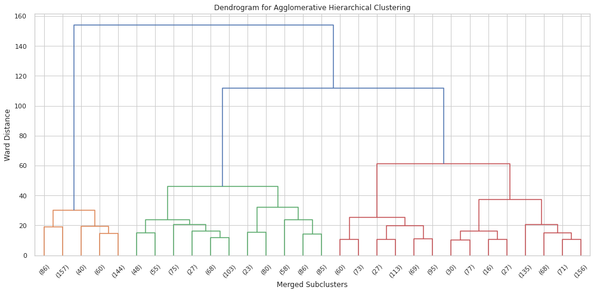
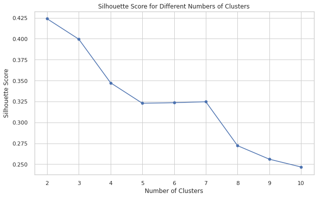
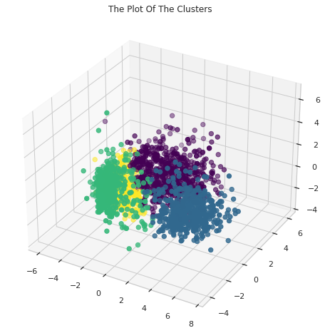
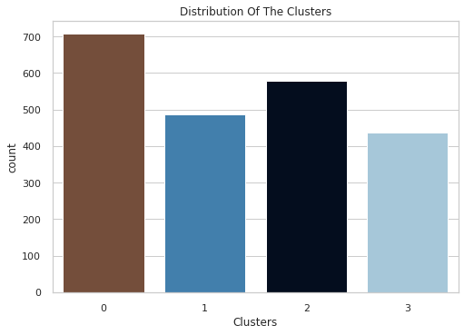
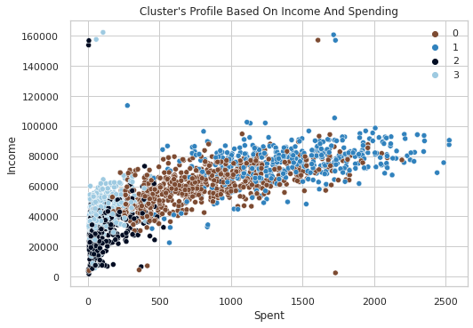

<h1 align="center">Customer Segmentation with Agglomerative Hierarchical Clustering</h1>

<p align="center">An unsupervised learning project that segments retail customers into distinct groups using <b>Agglomerative Hierarchical Clustering</b>, based on demographic attributes and purchasing behavior.</p>

## Overview

Customer segmentation divides a customer base into groups that share similar characteristics, so a business can personalize marketing, improve engagement, and allocate resources more effectively. This project applies **Agglomerative (bottom-up) Hierarchical Clustering** with **Ward linkage** to a grocery retailer's customer dataset, after reducing dimensionality with **PCA**.

**Pipeline:**

```
Raw data → Cleaning & feature engineering → Encoding & scaling
→ PCA (3 components) → Dendrogram + Silhouette analysis
→ Agglomerative Clustering (Ward linkage, k=4) → Cluster evaluation & profiling
```

## Dataset

- **Source:** [Kaggle — Customer Personality Analysis](https://www.kaggle.com/datasets/imakash3011/customer-personality-analysis)
- **Size:** ~2,240 customer records, 29 raw attributes
- **File:** `marketing_campaign.csv` (tab-separated)

Feature groups:
| Category | Examples |
|---|---|
| Customer info | `Year_Birth`, `Education`, `Marital_Status`, `Income`, `Kidhome`, `Teenhome`, `Dt_Customer`, `Recency` |
| Product spending | `MntWines`, `MntFruits`, `MntMeatProducts`, `MntFishProducts`, `MntSweetProducts`, `MntGoldProds` |
| Promotions/campaigns | `NumDealsPurchases`, `AcceptedCmp1–5`, `Response` |
| Purchase channels | `NumWebPurchases`, `NumCatalogPurchases`, `NumStorePurchases`, `NumWebVisitsMonth` |

> The notebook expects the CSV at `data/marketing_campaign.csv`. Download it from the link above and drop it in a `data/` folder before running (see [Setup](#setup) below).

## Methodology

1. **Data cleaning** — drop rows with missing `Income`, parse `Dt_Customer` as datetime, remove outliers (`Age < 90`, `Income < 600000`).
2. **Feature engineering** — derive `Age`, `Spent` (total 2‑year spending), `Living_With`, `Children`, `Family_Size`, `Is_Parent`; simplify `Education` into three tiers.
3. **Encoding & scaling** — label-encode categorical features, standardize all features with `StandardScaler`.
4. **Dimensionality reduction** — PCA to 3 principal components for clustering and 3D visualization.
5. **Clustering** — Agglomerative Clustering with Ward linkage.
   - Dendrogram analysis to inspect the merge hierarchy.
   - Silhouette Score across `k = 2..10` to help select the number of clusters.
   - Comparison of **Ward, Complete, Average, and Single** linkage using Silhouette Score and Davies-Bouldin Index.
   - Final model: `AgglomerativeClustering(n_clusters=4, linkage='ward')`.
6. **Evaluation** — Silhouette Score, Davies-Bouldin Index, cluster size balance.
7. **Profiling** — exploratory analysis of income, spending, campaign response, purchase channels, and household characteristics per cluster.

## Results

**Dendrogram** — the hierarchical merge structure used to pick the number of clusters:

<p align="center"></p>

**Silhouette Score by number of clusters** — used alongside the dendrogram to settle on `k=4`:

<p align="center"></p>

**Final clusters in 3D PCA space:**

<p align="center"></p>

**Cluster size distribution:**

<p align="center"></p>

**Income vs. spending by cluster** — the main axis used to interpret the segments:

<p align="center"></p>

Four customer segments were identified and profiled:

| Cluster | Profile |
|---|---|
| 0 | Middle-income, moderate-to-high spending — the retailer's core segment |
| 1 | High-income, high-spending — premium/high-value customers |
| 2 | Low-income, low-spending — budget-conscious, price-sensitive |
| 3 | Moderate-income, low-spending — under-engaged, opportunity for targeted marketing |

Full profiling (household size, parenthood, campaign response, channel preference per cluster) is in the notebook.

## Project Structure

```
.
├── agglomerative-hierarchical-clustering.ipynb   
├── data/                                         
├── images/                                        
├── requirements.txt
└── README.md
```

## Setup

```bash
git clone <your-repo-url>
cd <your-repo-name>
python -m venv venv
source venv/bin/activate        # Windows: venv\Scripts\activate
pip install -r requirements.txt
```

Download `marketing_campaign.csv` from Kaggle and place it in a `data/` folder — the notebook already reads from `data/marketing_campaign.csv`.

Then launch:

```bash
jupyter notebook agglomerative-hierarchical-clustering.ipynb
```

## Tech Stack

- Python 3
- pandas, numpy — data handling
- scikit-learn — `AgglomerativeClustering`, `PCA`, `StandardScaler`, `LabelEncoder`, silhouette/Davies-Bouldin metrics
- scipy — dendrogram / linkage matrix
- matplotlib, seaborn — visualization

## Known Limitations / Notes

- Clustering is unsupervised — there's no ground-truth label, so cluster quality is assessed with internal metrics (Silhouette Score, Davies-Bouldin Index) and business-sense profiling rather than accuracy.
- `Age` is computed relative to the current year at runtime, so re-running the notebook in a later year will shift the age distribution slightly (expected behavior, not a bug).


